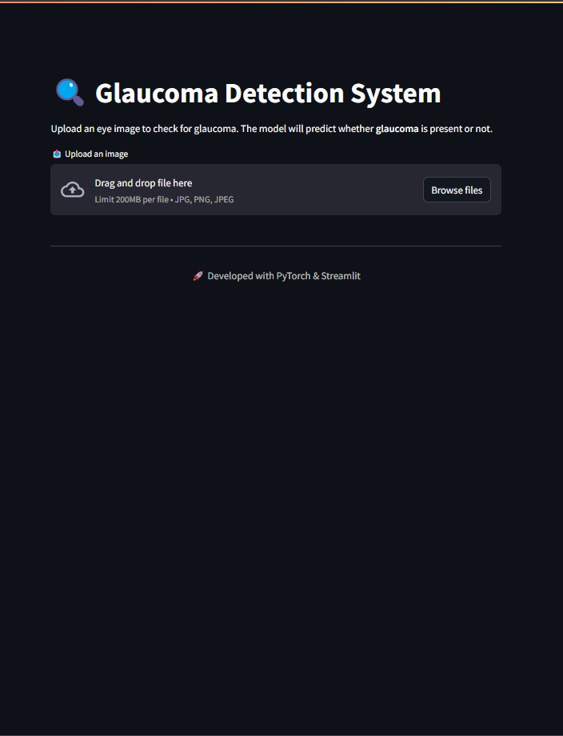
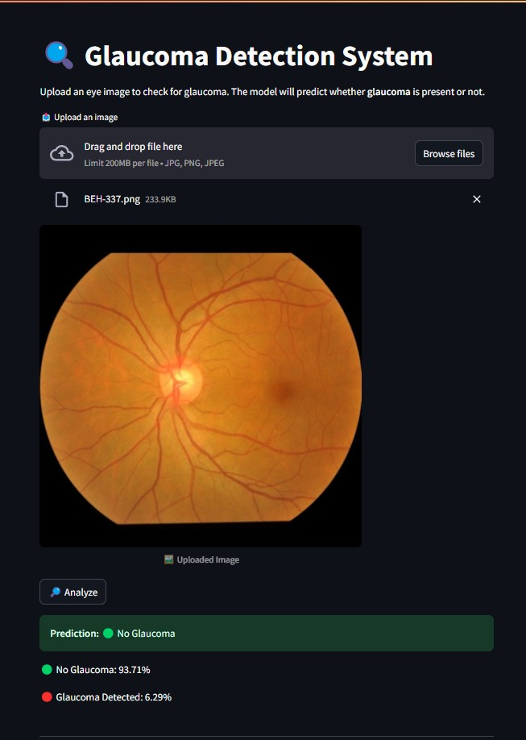

# 🩺 Glaucoma Detection using CNN

A deep learning-based Glaucoma Detection System that classifies retinal images as Glaucoma or No Glaucoma using a Convolutional Neural Network (CNN). Built with PyTorch and deployed using Streamlit.

## Dataset

- You can download the dataset from here [Kaggle Dataset](https://www.kaggle.com/datasets/sabari50312/fundus-pytorch)

## Models 🤖

- You can download the models from here [HuggingFace Models](https://huggingface.co/KarthikNot/glaucoma-detection)

## 📌 Features

- Upload an eye image for analysis 📤
- Predict whether Glaucoma is present or not 🔍
- Displays confidence scores for predictions 📊
- Simple and interactive web UI with Streamlit 🎨

## Folder Structure (Post-Project Setup) 📁

This section outlines the directory structure of the project after setup, providing a clear overview of the organization of files and folders.

📁 glaucoma-detection  
│── 📁 data/  
│ ├── 📁 images <span style="opacity: 0.3;"># Contains server images (Used in README.md)</span>  
│── 📁 models <span style="opacity: 0.3;"># Directory for trained CNN models</span>  
│── 📁 notebook <span style="opacity: 0.3;"># Jupyter notebooks for model experimentation and testing</span>  
│ ├── Glaucoma_Prediction.ipynb  
│── 📁 venv/ <span style="opacity: 0.3;"># Virtual environment (excluded from version control)</span>  
│── 📜 .gitignore <span style="opacity: 0.3;"># Specifies files and directories to ignore in Git</span>  
│── 📜 README.md <span style="opacity: 0.3;"># Comprehensive project documentation</span>  
│── 📜 requirements.txt <span style="opacity: 0.3;"># Lists all project dependencies</span>  
│── 📜 server.py <span style="opacity: 0.3;"># Streamlit application for glaucoma detection</span>

## Demo 🖥️





## 🛠️ How to Set Up This Project

This guide will help you set up the project's environment seamlessly.

**<u>1. Install Python</u> 🐍**

If you haven't installed Python yet, visit the official download page: [Python Download Guide](https://wiki.python.org/moin/BeginnersGuide/Download) and follow the instructions for your operating system (Windows, macOS, or Linux).

**<u>2. Create a Virtual Environment</u>**

1. Creating a virtual environment:

   - In the terminal, run this command:

   ```bash
   python -m venv venv
   ```

2. Activate the virtual environment:

   - To activate the virtual environment, use:

   ```bash
   .\venv\Scripts\activate
   ```

**3. Clone the Repository 📥**

1. Open your Git client or terminal.
2. Navigate to the directory where you want to clone the repository.
3. Run the following command, replacing `<repository_url>` with the actual URL of the project's repository:

```bash
git clone <repository_url>
```

**3. Install required Dependencies 📦**

1. Open terminal/cmd.
2. Navigate to repo directory
3. Run the following command to install dependencies from requirements.txt:

```bash
pip install -r requirements.txt
```

**4. Host the project Locally 🌐**

- After installing the required dependencies, run the following command to start the project locally:

```bash
streamlit run ./server.py
```
